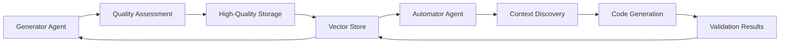

# TestTeller Architecture

## Overview

TestTeller features a modular architecture built around a **dual-feedback RAG (Retrieval-Augmented Generation) system** that enables continuous learning and improvement. The system consists of interconnected agents that share knowledge through a centralized vector store.

## System Architecture Diagram



## Core Components

### 1. Generator Agent
**Purpose**: Intelligent test case generation with self-improving capabilities

**Key Features**:
- Strategic test case analysis and generation
- Context-aware prompt engineering
- Multi-format document parsing and understanding
- Quality-driven output generation

**Architecture**:
- Document ingestion and parsing layer
- Context retrieval from vector store
- LLM-powered generation engine
- Quality assessment pipeline

### 2. Automator Agent  
**Purpose**: RAG-enhanced test automation code generation

**Key Features**:
- Multi-language code generation (Python, JavaScript, TypeScript, Java)
- 20+ framework support with optimizations
- 9 specialized RAG queries for context discovery
- Production-ready code output with validation

**Architecture**:
- Multi-format test case parser
- Context discovery engine with 9 specialized queries
- Framework-specific code generators
- Validation and optimization pipeline

### 3. Core Engine
**Purpose**: Unified infrastructure for LLM integration and vector storage

**Components**:
- **Multi-Provider LLM Support**: Unified interface for Gemini, OpenAI, Claude, Llama
- **Vector Store Management**: ChromaDB integration with advanced querying
- **Document Processing**: Universal parser with intelligent chunking
- **Configuration Management**: Flexible provider and model configuration

## Dual-Feedback Learning System

### Feedback Loop Architecture

#### Generation Feedback
1. **Quality Assessment**: AI-powered scoring (0.0-1.0) based on:
   - Completeness of test cases
   - Structure and organization
   - Detail level and actionability
   
2. **Intelligent Storage**: 
   - Only high-quality tests (>0.7 score) stored
   - Smart deduplication prevents redundant storage
   - Metadata enrichment for better retrieval

3. **Learning Integration**:
   - High-quality content becomes training examples
   - Patterns learned for future generations
   - Context enrichment improves retrieval accuracy

#### Automation Validation Feedback  
1. **Code Validation Results**: 
   - Syntax and framework compliance checking
   - Execution success/failure tracking
   - Performance metrics collection

2. **Metadata Enrichment**:
   - Successful automation patterns stored
   - Framework-specific optimizations learned  
   - Error patterns used for improvement

3. **Cross-Agent Learning**:
   - Automation results inform test generation
   - Successful patterns enhance future code generation
   - Knowledge shared between Generator and Automator agents

### Architectural Benefits

#### Self-Improving Capability
- **Compound Learning**: Each generation cycle improves future outputs
- **Pattern Recognition**: System learns from successful test and automation patterns
- **Quality Evolution**: Quality standards improve over time based on successful outcomes

#### Cross-Agent Intelligence  
- **Shared Knowledge Base**: Both agents benefit from each other's learnings
- **Contextual Awareness**: Generator learns from automation success/failure patterns
- **Code Quality**: Automator learns from high-quality test case structures

#### Quality Control
- **Threshold-Based Learning**: Only validated, high-quality content influences future outputs
- **Deduplication**: Prevents knowledge base pollution with redundant information
- **Retention Management**: Configurable retention policies maintain knowledge base quality

## Technical Implementation

### Vector Store Architecture
**Technology**: ChromaDB with advanced querying capabilities

**Features**:
- **Semantic Search**: Context-aware document retrieval
- **Metadata Filtering**: Rich metadata for precise query targeting
- **Collection Management**: Isolated knowledge bases per project
- **Persistence**: Local and remote storage options

**Storage Strategy**:
```
Collection Structure:
├── Original Documents (requirements, specs, code)
├── Generated Test Cases (high-quality only, >0.7 score)  
├── Automation Results (successful patterns, framework configs)
└── Metadata (quality scores, timestamps, source information)
```

### Document Processing Pipeline

#### Universal Parser
1. **Format Detection**: Automatic detection of document types
2. **Content Extraction**: Format-specific content extraction with structure preservation
3. **Intelligent Chunking**: Context-aware splitting that maintains semantic meaning
4. **Metadata Enrichment**: Document type, source, quality indicators

#### Enhanced RAG Ingestion
1. **Document Intelligence**: Automatic categorization (requirements, test cases, API docs, specifications)
2. **Semantic Chunking**: Preserves document structure and relationships  
3. **Batch Processing**: Concurrent processing with configurable performance settings
4. **Quality Assessment**: Content quality evaluation during ingestion

### LLM Integration Architecture

#### Multi-Provider Support
```
LLM Interface Layer
├── Google Gemini Integration
├── OpenAI Integration  
├── Anthropic Claude Integration
└── Ollama (Llama) Integration
```

**Provider Abstraction**:
- Unified interface for all providers
- Provider-specific optimizations
- Automatic fallback and retry mechanisms
- Model-specific prompt engineering

#### Model Selection Strategy
- **Generation Models**: Optimized for each provider's strengths
- **Embedding Models**: Provider-specific embedding strategies
- **Fallback Chains**: Automatic provider switching on failures
- **Performance Optimization**: Provider-specific request optimization

### Context Discovery Engine (Automator Agent)

#### 9 Specialized RAG Queries
1. **API Discovery Query**: "Find API endpoints, request/response schemas, authentication patterns"
2. **UI Pattern Query**: "Discover UI component patterns, selectors, interaction methods"
3. **Authentication Query**: "Identify authentication flows, token management, session handling"
4. **Data Model Query**: "Extract data models, validation rules, schema definitions"
5. **Test Pattern Query**: "Find existing test implementations and patterns"
6. **Similar Implementation Query**: "Locate similar test cases and automation patterns"
7. **Configuration Query**: "Discover environment configs, setup requirements"
8. **Error Handling Query**: "Identify error patterns, exception handling, edge cases"
9. **Integration Query**: "Find integration patterns, service communication, dependencies"

#### Query Optimization
- **Semantic Relevance**: Queries tuned for maximum contextual relevance
- **Result Ranking**: Advanced scoring for query result prioritization  
- **Context Aggregation**: Intelligent combination of multiple query results
- **Performance Optimization**: Efficient querying with caching strategies

## Configuration & Environment Management

### Environment Configuration
```
Configuration Layers:
├── Provider Configuration (API keys, models, endpoints)
├── Document Processing (chunk sizes, overlap, file types)
├── Vector Store Settings (host, port, collection management)
├── Quality Thresholds (scoring, storage, retention)
└── Output Configuration (formats, destinations, templates)
```

### Modular Configuration System
- **Provider-Specific Setup**: Dedicated configuration flows for each LLM provider
- **Validation Pipeline**: Real-time configuration validation with helpful error messages
- **Environment Detection**: Automatic optimal configuration detection
- **Backward Compatibility**: Support for existing configuration formats

## Scalability & Performance

### Performance Optimizations
- **Concurrent Processing**: Parallel document processing and ingestion
- **Efficient Querying**: Optimized vector store queries with caching
- **Batch Operations**: Bulk processing capabilities for large document sets
- **Resource Management**: Configurable resource limits and optimization

### Scalability Features
- **Horizontal Scaling**: Support for remote ChromaDB instances
- **Load Distribution**: Configurable concurrent processing limits
- **Memory Management**: Efficient memory usage with streaming processing
- **Storage Optimization**: Intelligent storage management with retention policies

## Security & Privacy

### Data Security
- **Local Processing**: Option for complete local operation with Llama/Ollama
- **API Key Management**: Secure storage and rotation of provider API keys
- **Data Isolation**: Project-specific collections prevent data cross-contamination
- **Access Control**: Configurable access patterns for different environments

### Privacy Considerations  
- **Local Inference**: Full privacy with local Llama models
- **Data Retention**: Configurable retention policies for sensitive data
- **Metadata Control**: Fine-grained control over metadata storage and sharing
- **Audit Trails**: Comprehensive logging for compliance and debugging