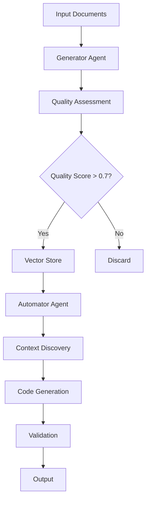

# TestTeller Documentation

<div align="center">

**AI-Powered Test Generation and Automation Agent**

<br>

[](https://pypi.org/project/testteller/)
[](https://hub.docker.com/r/iavipro/testteller)
[](https://opensource.org/licenses/Apache-2.0)
[](https://pypi.org/project/testteller/)

</div>

---

## Quick Navigation

<table>
  <tr>
    <td><b>📖 Documentation</b></td>
    <td><b>🚀 Resources</b></td>
    <td><b>🤝 Community</b></td>
  </tr>
  <tr>
    <td>
      <a href="ARCHITECTURE.md">Architecture</a><br>
      <a href="FEATURES.md">Features</a><br>
      <a href="COMMANDS.md">Commands</a><br>
      <a href="TESTING.md">Testing Guide</a>
    </td>
    <td>
      <a href="https://github.com/AviralNigam/testteller-agent">GitHub Repository</a><br>
      <a href="https://github.com/AviralNigam/testteller-agent/blob/main/README.md">README</a><br>
      <a href="https://pypi.org/project/testteller/">PyPI Package</a><br>
      <a href="https://hub.docker.com/r/iavipro/testteller">Docker Hub</a>
    </td>
    <td>
      <a href="https://github.com/iAviPro/testteller-agent/issues">Issues</a><br>
      <a href="https://github.com/iAviPro/testteller-agent/discussions">Discussions</a><br>
      <a href="https://github.com/iAviPro/testteller-agent/blob/main/CONTRIBUTING.md">Contributing</a><br>
      <a href="https://github.com/iAviPro/testteller-agent/blob/main/LICENSE">License</a>
    </td>
  </tr>
</table>

---

## What is TestTeller?

TestTeller is an intelligent test generation and automation agent that leverages:
- **RAG (Retrieval-Augmented Generation)** for context-aware test creation
- **Multiple LLM Providers** (Gemini, OpenAI, Claude, Llama)
- **Dual-feedback System** for continuous learning and improvement
- **Multi-language Support** for various programming languages and frameworks

### Key Capabilities

| Feature | Description |
|---------|-------------|
| **Test Generation** | Creates comprehensive test cases from documents, specifications, and code |
| **Automation Code** | Generates production-ready automation scripts in multiple languages |
| **Framework Support** | Works with 20+ testing frameworks out of the box |
| **Quality Assessment** | Built-in quality scoring and validation |
| **Continuous Learning** | Improves over time through feedback loops |

---

## Documentation Pages

### [Architecture](ARCHITECTURE.md)
Deep dive into TestTeller's modular architecture:
- Dual-feedback RAG System
- Generator and Automator Agents
- Vector Store Integration
- Quality Assessment Pipeline

### [Features](FEATURES.md)
Comprehensive feature overview:
- Multiple LLM Provider Support
- Test Generation Capabilities
- Automation Framework Support
- Learning and Feedback Systems

### [Commands Reference](COMMANDS.md)
Complete CLI command documentation:
- Configuration Commands
- Test Generation Commands
- Automation Commands
- Knowledge Base Management

### [Testing Guide](TESTING.md)
Testing approach and guidelines:
- Simplified Test Structure
- Running Tests
- Test Design Philosophy
- Maintenance Guidelines

---

## Quick Start

### Installation

```bash
# Using pip
pip install testteller

# Using Docker
docker pull iavipro/testteller:latest

# From source
git clone https://github.com/AviralNigam/testteller-agent.git
cd testteller-agent
pip install -e .
```

### Basic Usage

```bash
# Configure TestTeller
testteller configure

# Generate test cases
testteller generate requirements.md -c collection_name

# Create automation code
testteller automate test-cases.md --language python --framework pytest -c collection_name
```

### Example Workflow

1. **Configure Provider**
   ```bash
   testteller configure --provider gemini
   ```

2. **Generate Test Cases**
   ```bash
   testteller generate docs/ --output test-suite.md
   ```

3. **Create Automation**
   ```bash
   testteller automate test-suite.md --discover-context
   ```

---

## Architecture Overview



---

## Supported Frameworks

<table>
  <tr>
    <th>Language</th>
    <th>Frameworks</th>
  </tr>
  <tr>
    <td><b>Python</b></td>
    <td>pytest, unittest, behave, robot, locust</td>
  </tr>
  <tr>
    <td><b>JavaScript</b></td>
    <td>jest, mocha, cypress, playwright, puppeteer</td>
  </tr>
  <tr>
    <td><b>TypeScript</b></td>
    <td>jest, mocha, cypress, playwright</td>
  </tr>
  <tr>
    <td><b>Java</b></td>
    <td>junit, testng, selenide, restassured</td>
  </tr>
</table>

---

## Latest Updates

### Version 1.0.0
- Initial stable release
- Support for 4 LLM providers
- 20+ testing frameworks
- RAG-enhanced automation generation
- Quality-driven feedback loops

---

## Resources & Links

### Project Resources
- [GitHub Repository](https://github.com/iAviPro/testteller-agent) - Source code and development
- [README](https://github.com/iAviPro/testteller-agent/blob/main/README.md) - Project overview
- [PyPI Package](https://pypi.org/project/testteller/) - Python package
- [Docker Hub](https://hub.docker.com/r/iavipro/testteller) - Container images

### Community
- [Report Issues](https://github.com/iAviPro/testteller-agent/issues) - Bug reports and feature requests
- [Discussions](https://github.com/iAviPro/testteller-agent/discussions) - Questions and ideas
- [Contributing](https://github.com/iAviPro/testteller-agent/blob/main/CONTRIBUTING.md) - How to contribute

---

<div align="center">
  <p>
    <a href="https://github.com/iAviPro/testteller-agent">
      
    </a>
    <a href="https://pypi.org/project/testteller/">
      
    </a>
  </p>
  
  <strong>TestTeller - Intelligent Test Agent for Modern Development</strong>
</div>